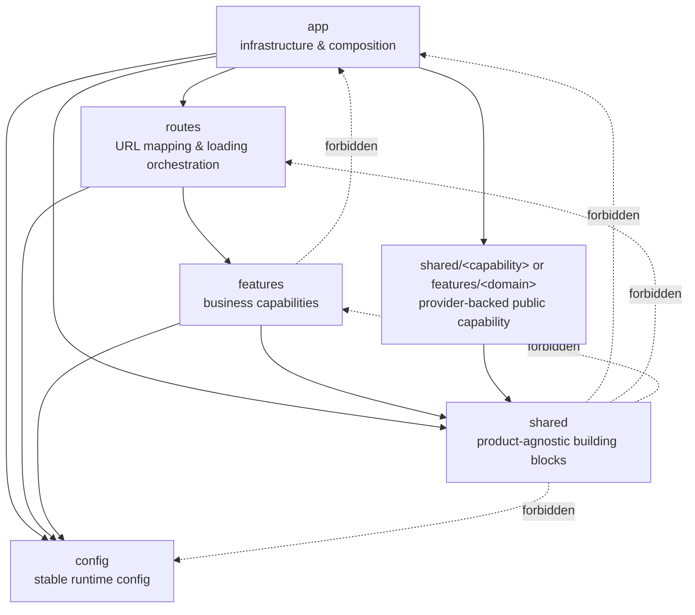

# React App Template

<p align="center">
  
</p>

<p align="center">
  <strong>A team-oriented React starter for scalable frontend applications.</strong>
</p>

<p align="center">
  
  
  
  
  
  
  
  
</p>

<p align="center">
  English | <a href="./README.zh-CN.md">简体中文</a>
</p>

A team-oriented React starter built on React 19, Vite 8, TanStack Router, TanStack Query, Tailwind CSS v4, and Vitest. The template keeps runtime defaults conservative and pushes app wiring, monitoring, and transport setup into explicit boundaries.

## Why This Template

- Clear architectural boundaries for `config`, `app`, `routes`, `features`, and `shared`.
- Production-oriented defaults for routing, server state, error handling, formatting, and tests.
- Team-friendly documentation with dependency direction diagrams and directory-level README files.
- Minimal runtime assumptions with explicit imports, feature-owned integrations, and no generic `components/` dumping ground.

## Quick Start

### Requirements

- Node.js `>=22.0.0`
- pnpm `>=10.24.0`

### Run locally

```bash
pnpm install
pnpm dev
```

The dev server runs on `http://localhost:3000`.

### Optional initialization

If you want a clean project baseline after cloning the template, run:

```bash
pnpm init:template
```

The one-time initializer removes demo features and demo routes, updates starter files, regenerates `src/routeTree.gen.ts`, and then deletes its own command entry and script file.

## Scripts

```bash
pnpm dev          # start Vite dev server
pnpm build        # typecheck and create a production build
pnpm preview      # preview the built app locally
pnpm test         # run Vitest in watch mode
pnpm test:run     # run tests once
pnpm lint         # run ESLint
pnpm lint:fix     # apply ESLint fixes
pnpm format       # verify Prettier formatting
pnpm format:fix   # rewrite files with Prettier
pnpm typecheck    # run TypeScript project checks
pnpm init:template # one-time cleanup of demo features and routes, then self-remove
pnpm check        # lint + format + typecheck + test
pnpm check:fix    # apply local lint and format fixes
```

## Docker Deployment

Build the static production image and serve it with Nginx:

```bash
docker build -t react-app:local .
docker run --rm -p 8080:80 react-app:local
```

The container serves the app at `http://localhost:8080`. The image is built in multiple stages: Node and pnpm create the Vite `dist/` output, then Nginx serves only the static assets.

The root `nginx.conf` includes an SPA fallback so TanStack Router routes can be refreshed directly. `VITE_*` environment variables are injected at build time; if a project needs runtime environment switching, add a separate runtime config mechanism such as `/config.js` or `/env.json`.

## Project Layout

```text
public/
└── app-icon.svg                # Static public asset served from a stable URL

types/
└── .gitkeep                    # Placeholder for repo-level ambient declarations

src/
├── main.tsx                    # React app bootstrap
├── App.tsx                     # Root composition component for providers and router
├── style.css                   # Global styles and Tailwind CSS entry
├── setupTests.ts               # Vitest and Testing Library setup
├── routeTree.gen.ts            # Generated TanStack Router route tree; do not edit manually
│
├── config/                     # Runtime environment config shared by app, routes, and features
│   ├── README.md
│   └── env.ts
│
├── app/                        # App-level infrastructure and wiring
│   ├── monitoring/             # Error reporting integration point
│   │   └── reportError.ts
│   ├── providers/              # Global provider composition
│   │   └── QueryProvider.tsx
│   ├── query/                  # Shared app-level QueryClient setup
│   │   └── queryClient.ts
│   └── router/                 # Router instance, defaults, and devtools
│       ├── context.ts
│       ├── router.tsx
│       └── RouterDevtools.tsx
│
├── routes/                     # TanStack file-based routes
│   ├── -__root.spec.tsx        # Root route behavior tests
│   ├── __root.tsx              # Root route layout, outlet, and error boundary
│   ├── error.tsx               # Demo error route
│   ├── index.tsx               # Route for /
│   └── posts.tsx               # Demo data route delegating to a feature page
│
├── features/                   # Product or demo capabilities grouped by domain
│   ├── example-counter/        # Demo local state feature
│   │   ├── assets/
│   │   ├── hooks/
│   │   ├── lib/
│   │   ├── model/
│   │   └── ui/
│   ├── example-posts/          # Demo server-state feature
│   │   ├── api/
│   │   ├── hooks/
│   │   ├── model/
│   │   └── ui/
│   ├── home/
│   │   └── ui/
│   │       └── HomePage.tsx
│
└── shared/                     # Reusable, product-agnostic building blocks
    ├── assets/                 # Shared media imported by application code
    │   └── README.md
    ├── ui/                     # Shared UI components
    │   ├── Button.tsx
    │   ├── NotFound.tsx
    │   ├── PageErrorFallback.tsx
    │   └── index.ts
    └── lib/                    # Pure helpers and framework-light utilities
        ├── dayjs.ts
        ├── sleep.ts
        └── index.ts
```

### Directory Boundaries

- `config` owns runtime environment config that may be read by `app`, `routes`, and `features`.
- `app` owns cross-cutting application infrastructure: providers, router setup, devtools, and monitoring.
- `routes` owns URL-to-page mapping. Route files should stay thin and delegate page implementation to `features`.
- `features` owns business or demo capabilities. Add real product behavior here by domain.
- `shared` owns reusable UI and pure helpers. It should not depend on `app`, `routes`, or `features`.
- `public` owns static files that must be served from stable URLs without Vite imports.
- `types` owns repo-level ambient declarations. Do not scatter global `.d.ts` files under `src`.
- `routeTree.gen.ts` is generated by TanStack Router and should not be edited manually.

Features may read stable runtime configuration from `config`, for example `appEnv`, but should not depend on app wiring such as `app/router`, `app/providers`, or `app/monitoring`. Shared code must not read `config`; pass environment-derived values into shared utilities instead.

`app/providers` is a composition layer, not a feature-facing API. If a provider exposes behavior that features consume, such as theme, auth, or i18n, put the reusable provider, hooks, and types in `shared/<capability>` for product-agnostic capabilities or `features/<domain>` for business capabilities. Then compose that provider from `app/providers`.

The template now wires a shared app-level `QueryClient` into TanStack Router context. Route loaders can preload feature-owned `queryOptions()` through `context.queryClient.ensureQueryData(...)`, while components reuse the same cache entry through feature hooks.

### Dependency Direction



- `shared` is the lowest layer and must stay independent from `app`, `routes`, and `features`.
- `app` wires infrastructure and may compose routes, shared modules, and provider-backed public capabilities.
- `routes` orchestrates URL behavior and loading, then delegates page implementation to `features`.
- `features` may depend on `shared` and stable `config`, but not app wiring modules.
- Provider-backed capabilities should be exposed from `shared` or a public feature API, then composed in `app/providers`.

### Feature Module Convention

Feature modules start small and grow by need. Use `ui/` for feature-owned components and page sections, `api/` for feature-specific data access, `model/` for domain types, schemas, query keys, or local state, `hooks/` for feature-specific React hooks, `lib/` for feature-only pure helpers, `constants/` for feature-only constants, and `assets/` for feature-owned images, videos, SVG files, or other media imported by feature code.

```text
src/features/<feature-name>/
├── ui/
├── api/
├── model/
├── hooks/
├── lib/
├── assets/
└── constants/
```

Do not create empty folders by default. Add a folder only when the feature has code that clearly belongs there. Keep feature-specific requests under the owning feature, and introduce shared request infrastructure only when a real transport layer or generated SDK is needed.

### Asset Placement

Use `public/` for favicon, PWA icons, SEO images, and files that need stable public URLs. Use `src/shared/assets/` for product-agnostic images, videos, SVG files, or other media imported by multiple modules and processed by Vite. Use `src/features/<feature>/assets/` for feature-private media. If an SVG should be consumed as a reusable React icon component, place it under `src/shared/ui/icons/` when that icon layer is introduced.

### Exports and Public Features

Use barrel exports only for stable public boundaries. The template keeps `src/shared/ui/index.ts` and `src/shared/lib/index.ts` because those folders expose reusable, product-agnostic APIs. Do not add `src/app/index.ts`, `src/config/index.ts`, `src/features/index.ts`, route barrels, or feature subfolder barrels just to shorten imports.

Public business capabilities still belong in `src/features/<domain>`, not in `shared`. Examples include `auth`, `current-user`, `permissions`, and `notifications`. Add `src/features/<feature>/index.ts` only when a feature intentionally exposes a stable public API consumed by multiple modules; export only public components, hooks, and types, not private endpoints, tests, or implementation details.

### Data Fetching

This template does not include a shared HTTP client. Keep request functions inside the owning feature, query keys and query options in `model`, React Query hooks in `hooks`, and loading, error, empty, and success states in feature `ui`.

```text
src/features/example-posts/
├── api/getPosts.ts             # feature-owned request function
├── hooks/usePostsQuery.ts      # React Query binding
├── model/queryOptions.ts       # shared query options for hooks and loaders
├── model/queryKeys.ts          # query key factory
├── model/types.ts              # domain type
└── ui/PostsPage.tsx            # route page reusing feature query state
```

When route loaders need data, they should call feature-owned query options, not feature endpoints directly. This keeps route preloading and component `useQuery` on the same query key and cache entry.

```ts
export const Route = createFileRoute('/posts')({
  loader: ({ context }) => {
    return context.queryClient.ensureQueryData(postsQueryOptions())
  },
  component: PostsPage,
})
```

Do not add a top-level `src/api`. Do not call `fetch` directly from React components, hooks, or route files; keep network access in feature `api` files when a real backend exists. When a real backend integration needs base URLs, authentication, retries, OpenAPI, ky, Axios, or RPC clients, design that transport layer from the project requirements instead of inheriting one from the template.

### Routes vs Feature Pages

Page-level business components belong in `features/<feature-name>/ui`. Route files should stay thin and focus on route semantics: path mapping, route params, search schemas, loaders, guards, redirects, and route-level pending or error behavior.

```tsx
import { createFileRoute } from '@tanstack/react-router'
import { UserListPage } from '@/features/users/ui/UserListPage'

export const Route = createFileRoute('/users')({
  component: UserListPage,
})
```

Reusable fallback pages such as generic not-found or error states belong in `shared/ui` when they are not owned by a specific feature.

If a route loader preloads React Query data, the app router context must expose the shared `queryClient`. The app layer owns that infrastructure wiring; route files still use feature `queryOptions` and do not own API details.

### Error Handling

Route-level render errors, loader errors, and route match errors should be handled with TanStack Router `errorComponent`. The root route provides the default fallback UI and reports caught errors through `reportError`.

React Query errors should still reset through `QueryErrorResetBoundary` inside the route error fallback. This clears query error state when the user retries.

Use `react-error-boundary` only for feature-local failures where a widget can fail while the rest of the page remains usable. Do not wrap the root route `<Outlet />` with a generic `react-error-boundary`; it does not own TanStack Router's route match lifecycle. Errors from event handlers, timers, and unhandled promises must be handled at the call site with `try/catch` or `.catch()`.

## Template Defaults

- Router and React Query devtools are enabled only in development.
- The template uses explicit imports throughout; helper APIs such as `tv()` should be imported where used.
- SVG and XML files are formatted with `@prettier/plugin-xml` through Prettier's XML parser.
- React Query uses conservative defaults: `staleTime: 30s`, `gcTime: 5m`, query `retry: 1`, mutation `retry: 0`, `refetchOnWindowFocus: false`, `refetchOnReconnect: true`.
- The template does not preselect a shared HTTP client; feature-owned `api` files may use native `fetch` until a real shared transport layer is justified.
- Route errors use TanStack Router `errorComponent`; query error retries are reset through `QueryErrorResetBoundary`, and reporting goes through a single adapter.

## Development Rules

- Use explicit imports for React, router, and app utilities.
- Keep business logic out of `app/`; add product behavior under feature modules as the project grows.
- Keep reusable UI under `shared/ui` and pure utilities under `shared/lib`.
- Let features read stable runtime config from `config` when needed, but keep them independent from app router, provider composition, and monitoring wiring.
- Keep feature-consumable provider capabilities outside `app/providers`; expose them from `shared/<capability>` or a public feature API, then compose them in `app/providers`.
- Keep feature-specific requests under the owning feature; introduce shared transport only when real integration requirements justify it.
- Use TanStack Router `errorComponent` for route-level error fallbacks. Use `react-error-boundary` only for clearly local feature widgets.
- Use barrel exports only at stable public boundaries such as `shared/ui` and `shared/lib`; avoid feature-wide or app-wide barrels by default.
- Do not reintroduce generic `components/` or `utils/` top-level folders; add code to `shared` or `features` instead.
- Do not hand-edit generated router output in `src/routeTree.gen.ts`.
- Run `pnpm check` before opening a PR.
