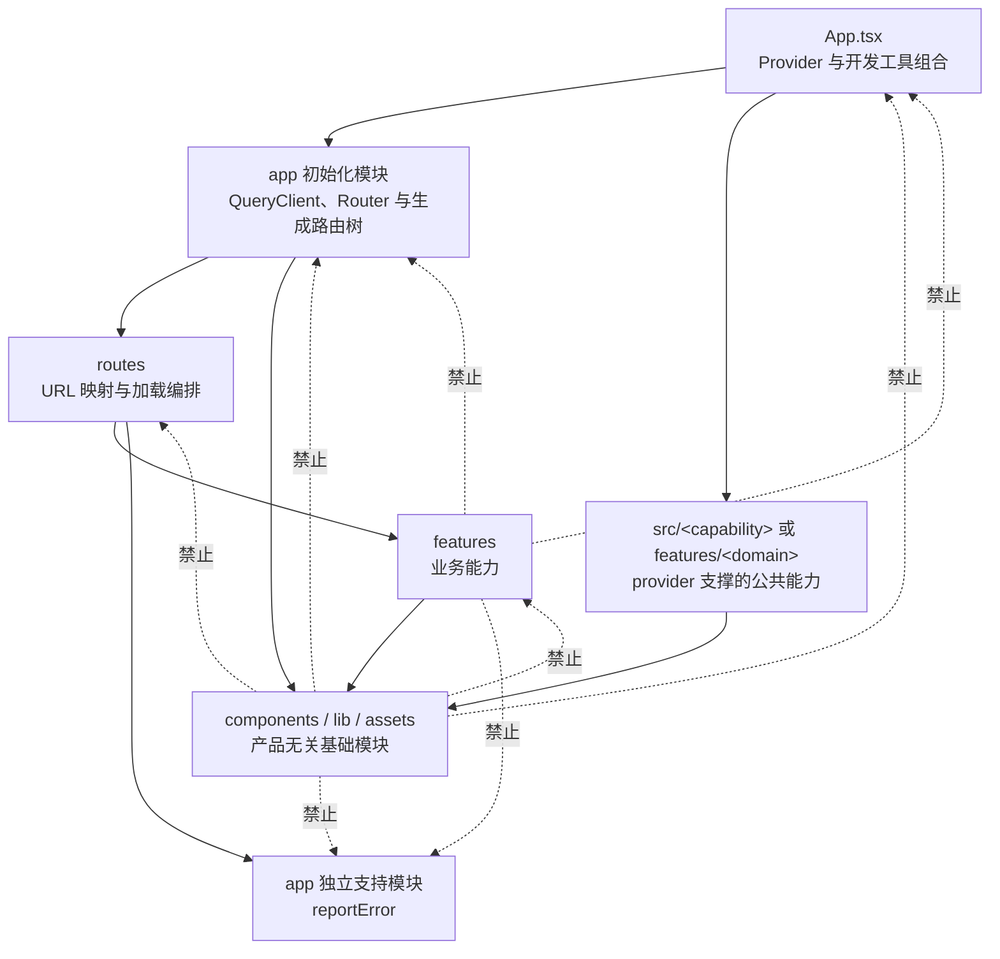

# React App Template

<p align="center">
  
</p>

<p align="center">
  <strong>一个面向团队协作、可扩展前端应用的 React 工程模板。</strong>
</p>

<p align="center">
  
  
  
  
  
  
  
  
  
</p>

一个面向团队协作的 React 工程模板，基于 React 19、Vite 8、TanStack Router、TanStack Query、Tailwind CSS v4 和 Vitest 构建。模板保持运行时默认配置克制，并将应用装配、监控和传输层扩展点放入清晰边界。

## 为什么选择这个模板

- 明确划分 `App.tsx`、`app`、`routes`、`features` 与通用基础目录的职责边界。
- 内置面向生产的路由、服务端状态、错误兜底、格式化和测试默认规则。
- 集中维护项目文档，说明目录约定和依赖方向。
- 保持克制的运行时假设：显式导入、按 feature 管理集成能力、不使用泛化 `components/` 堆放目录。

## 快速开始

### 环境要求

- Node.js `22.23.2`（`.nvmrc` 使用相同的精确版本）
- pnpm `10.24.0`

### 本地运行

```bash
pnpm install
pnpm dev
```

开发服务器运行在 `http://localhost:3000`。

## 脚本

```bash
pnpm dev          # 启动 Vite 开发服务器
pnpm build        # 执行类型检查并生成生产构建
pnpm preview      # 本地预览生产构建
pnpm test         # 以 watch 模式运行 Vitest
pnpm test:run     # 单次运行测试，适合 CI
pnpm lint         # 运行 ESLint
pnpm lint:fix     # 应用 ESLint 自动修复
pnpm format       # 检查 Prettier 格式
pnpm format:fix   # 使用 Prettier 重写文件
pnpm typecheck    # 运行 TypeScript 项目检查
pnpm check        # lint + format + typecheck + test
pnpm check:fix    # 应用本地 lint 和格式化修复
```

## Docker 部署

构建静态生产镜像，并通过 Nginx 托管：

```bash
docker build -t react-app:local .
docker run --rm -p 8080:80 react-app:local
```

容器访问地址为 `http://localhost:8080`。镜像使用多阶段构建：Node 和 pnpm 负责生成 Vite `dist/` 产物，最终阶段只用 Nginx 托管静态资源。

Nginx 对 `/assets/` 下带内容哈希的构建文件设置一年 `immutable` 缓存。该路径保留给 Vite 构建产物，不要在 `public/assets/` 放置固定文件名资源。HTML 和固定路径公共文件使用 `Cache-Control: no-cache`，复用前需要重新验证。不存在的静态文件路径（包括带扩展名的路径）返回 404，不回退到 SPA 页面；页面路由不要使用类似文件名的路径。Docker 安装依赖时采用与本地相同的工作区设置和 Node 版本检查。

根目录 `nginx.conf` 已包含 SPA fallback，TanStack Router 路由可以直接刷新。

### Docker 环境变量

根目录 `.env` 保存项目公开且必需的 Vite 构建默认值，并受 Git 跟踪。Docker 构建会读取同一份 `.env`，因此本地构建和默认镜像使用一致的 `VITE_SITE_NAME`。`.env.local`、`.env.production` 等覆盖文件仍会被 Git 和 Docker 构建上下文排除。

`VITE_SITE_NAME` 缺失或为空时，Vite 会立即终止启动或构建。所有 `VITE_*` 变量都会写入浏览器可访问的前端产物，因此不能存放密钥。修改这些值后需要重新构建；`docker run -e` 无法改变已经生成的静态文件。部署需要不同配置时，应在构建阶段注入对应值；若需要运行时切换环境，再按实际需求设计 `/config.js` 或 `/env.json` 等运行时配置机制。

## 项目结构

```text
public/
└── app-icon.svg                # 固定 URL 访问的公共静态资产

types/
├── tanstack-router.d.ts        # TanStack Router 类型注册
└── vite-env.d.ts               # Vite 环境变量类型

src/
├── main.tsx                    # React DOM 启动入口
├── App.tsx                     # providers 和开发工具装配
├── style.css                   # 全局样式和 Tailwind CSS 入口
├── setupTests.ts               # Vitest 与 Testing Library 测试初始化
│
├── app/                        # 当前应用的配置、初始化和集成
│   ├── queryClient.ts          # Provider 与 Router 共用的 QueryClient
│   ├── reportError.ts          # 独立的错误上报集成点
│   └── router/                 # TanStack Router 配置与应用级集成
│       ├── index.ts            # App 装配所需的受控公共接口
│       ├── RouterProgress.tsx  # 站内导航进度条
│       ├── RouterSpinner.tsx   # 首次加载的全屏遮罩
│       ├── LoaderSync.tsx      # 将 Router 状态同步到 loaderStore
│       ├── loaderStore.ts      # idle / boot / navigation 加载模式
│       ├── router.tsx          # Router 实例和默认配置
│       └── routeTree.gen.ts    # 生成的路由树；不要手动编辑
│
├── routes/                     # TanStack 文件路由
│   ├── -__root.spec.tsx        # 根路由行为测试
│   ├── __root.tsx              # 根路由 context、布局和错误边界
│   ├── $.tsx                   # 未知 URL 的 404 页面及元信息
│   ├── error.tsx               # demo error 路由
│   ├── loading.tsx             # Router 加载反馈演示路由
│   └── index.tsx               # / 路由
│
├── features/                   # 按业务域组织的产品或 demo 能力
│   ├── example-counter/        # demo Zustand 共享状态 feature
│   │   ├── model/
│   │   └── ui/
│   └── example-posts/          # demo server-state feature
│       ├── api/
│       ├── hooks/
│       ├── model/
│       └── ui/
│
├── assets/                     # 由应用代码 import 的共享媒体资源
├── components/                 # 产品无关的通用 UI 组件
│   ├── Button.tsx
│   ├── NotFound.tsx
│   ├── PageErrorFallback.tsx
│   └── index.ts
└── lib/                        # 通用工具函数
    ├── date.ts
    ├── sleep.ts
    └── index.ts
```

### 目录边界

- `App.tsx` 负责 Provider 和开发工具组合；`app` 管理应用配置、QueryClient 和 Router 初始化、错误上报及应用级集成组件。
- `routes` 负责 URL 到页面的映射，可包含简单静态页面和 feature 组合；业务逻辑、数据访问和复杂页面放在 `features`。
- `features` 负责业务或 demo 能力。新增真实产品行为时，优先按业务域放到这里。
- `components` 负责通用 UI，`lib` 负责通用工具，`assets` 负责共享导入资源。这些通用模块不应依赖 `App.tsx`、`app`、`routes` 或 `features`。
- `public` 负责不经过 Vite import、需要固定公开 URL 的静态文件。
- `types` 负责 repo 级 ambient declarations。不要在 `src` 下散落全局 `.d.ts` 文件。
- `app/router/routeTree.gen.ts` 由 TanStack Router 生成，输出路径在 Vite 插件配置中指定，不要手动编辑。

Features 和通用代码不能导入应用环境配置；如需环境派生值，应通过 feature 公共接口或通用工具参数传入。

Provider 在 `App.tsx` 中组合，而不是作为 feature 面向的公共 API。如果某个 provider 暴露 feature 会消费的通用能力，应按需将 provider、hooks 和 types 放到 `src/<capability>`，例如 `src/theme` 或 `src/i18n`；auth 等业务能力则放到 `features/<domain>`，再由 `App.tsx` 统一装配。不要预先创建空目录。

模板将应用级共享 QueryClient 注入 Router context，保留后续扩展 loader 的能力；当前文章示例仅在首页通过 PostsPreview 展示，不提供独立文章页面或 loader 预取示例。

### 依赖方向


```mermaid
flowchart TD
  App["App.tsx<br/>Provider 与开发工具组合"]
  TanStack["app 初始化模块<br/>QueryClient、Router 与生成路由树"]
  AppSupport["app 独立支持模块<br/>reportError"]
  Routes["routes<br/>URL 映射与加载编排"]
  Features["features<br/>业务能力"]
  Common["components / lib / assets<br/>产品无关基础模块"]
  ProviderCapability["src/&lt;capability&gt; 或 features/&lt;domain&gt;<br/>provider 支撑的公共能力"]

  App --> TanStack
  TanStack --> Routes
  TanStack --> Common
  App --> ProviderCapability
  Routes --> Features
  Routes --> AppSupport
  Features --> Common
  ProviderCapability --> Common

  Common -. 禁止 .-> App
  Common -. 禁止 .-> Routes
  Common -. 禁止 .-> Features
  Features -. 禁止 .-> App
  Features -. 禁止 .-> TanStack
  Common -. 禁止 .-> TanStack
  Features -. 禁止 .-> AppSupport
  Common -. 禁止 .-> AppSupport
```

- `components`、`lib` 和 `assets` 是通用基础层，必须独立于 `App.tsx`、`app`、`routes` 和 `features`。
- `App.tsx` 引用 `app` 的实例来组合 Provider；`app` 不提供顶层聚合入口，内聚子模块可以通过显式导出提供受控公共接口。
- 路由 head 可以直接读取 `VITE_SITE_NAME`，路由也可以导入独立的 `app/reportError`；但不得在运行时导入 Router 单例、生成路由树或 `App.tsx`，避免循环依赖。路由测试可以导入生成路由树，创建隔离的测试 Router。
- `routes` 负责编排 URL 行为和加载流程、组合 feature，也可实现简单静态页面。
- `features` 可以依赖通用基础模块和其他 feature 的公共 API，但不能依赖应用入口或 `app` 模块。
- Provider 支撑的公共能力应从按需创建的 `src/<capability>` 或公共 feature API 暴露，再由 `App.tsx` 装配。

### Feature 模块约定

Feature 模块从小开始，按需要增长。使用 `ui/` 放 feature 自己拥有的组件和页面分区，`api/` 放 feature 专属数据访问，`model/` 放领域类型、schema、query keys 或局部状态，`hooks/` 放 feature 专属 React hooks，`lib/` 放只服务当前 feature 的纯工具函数，`constants/` 放 feature 私有常量，`assets/` 放由 feature 代码 import 的 feature 自有图片、视频、SVG 或其他媒体资源。

```text
src/features/<feature-name>/
├── ui/
├── api/
├── model/
├── hooks/
├── lib/
├── assets/
└── constants/
```

不要默认创建空目录。只有当 feature 中确实有对应代码时才新增目录。Feature 专属请求应放在所属 feature 下；只有当项目真正需要通用传输层或 generated SDK 时，才引入共享请求基础设施。

`example-counter` 展示 Zustand 共享客户端状态：store 放在 feature 的 `model` 内，计数展示和操作组件分别按需订阅状态或操作，不通过 props 传递。所有 Counter 共享计数，从 0 开始，重置回 0；组件重新挂载保留计数，刷新页面后恢复为 0，不做持久化。`example-posts` 展示 TanStack Query 异步数据管理，按 feature 的实际复杂度增加目录即可。

组件局部状态仍使用 `useState`；需要跨组件共享的客户端状态使用 Zustand，并放在所属 feature 内；服务端数据及缓存使用 TanStack Query，不重复存入 Zustand。无需为此创建顶层 `store` 目录。

### 资产放置规则

`public/` 用于 favicon、PWA icon、SEO 图片，以及需要固定公开 URL 的文件。`src/assets/` 用于产品无关、被多个模块 import，并由 Vite 处理的图片、视频、SVG 或其他媒体资源。`src/features/<feature>/assets/` 用于 feature 私有媒体资源。如果某个 SVG 应作为可复用 React 图标组件使用，未来引入图标层时应放到 `src/components/icons/`。

### 导出与公共 Feature

Barrel export 只用于稳定公共边界。模板保留 `src/components/index.ts` 和 `src/lib/index.ts`，因为这些目录对外提供产品无关的可复用 API；`src/app/router/index.ts` 也通过显式导出提供 App 装配所需的受控接口。不要创建 `src/app/index.ts`，也不要为了缩短导入路径新增 `src/features/index.ts`、route 文件 barrel 或 feature 子目录 barrel。

公共业务能力仍然放在 `src/features/<domain>`，不要放进通用基础目录。典型例子包括 `auth`、`current-user`、`permissions` 和 `notifications`。只有当某个 feature 明确需要向多个模块暴露稳定公共 API 时，才添加 `src/features/<feature>/index.ts`；它只应导出公共组件、hooks、类型和共享 query options，不导出私有 endpoint、测试或实现细节。

首页直接从各 feature 的 UI 文件导入 Counter 和 PostsPreview，不为单个组件增加转导出入口。请求函数、query keys、query options 和 hooks 保留为模块内部实现。路由测试可直接模拟内部请求函数，不为测试扩大公共 API。

### 日期工具

`lib/date.ts` 提供常用日期格式化，并导出已配置 UTC、时区插件的 `dayjs` 和格式常量 `dayPatterns`。

```ts
import { dayjs, formatDate, formatDateTime, formatTime } from '@/lib'

formatDate('2026-09-16') // '2026-09-16'
formatDateTime(new Date(2026, 8, 16, 14, 30, 5)) // '2026-09-16 14:30:05'
formatTime(dayjs.utc('2026-09-16T14:30:05Z')) // '14:30:05'
formatDate(null) // ''
```

参数必传，但允许值为 `undefined` 或 `null`；空值、空白字符串和解析无效的日期返回空字符串，不默认显示当前时间。数字按毫秒时间戳处理，`0` 也是有效值。普通输入使用本地时区，Day.js 对象保留自身 UTC 或时区设置，原对象不会被修改。

这些函数沿用 Day.js 默认解析，不用于严格日期校验。自定义格式、时区转换等复杂需求直接使用 `dayjs`，不额外封装。

### 数据请求

模板不内置共享 HTTP client。请求函数放在所属 feature 的 `api`，query keys 和 query options 放在 `model`，React Query hooks 放在 `hooks`，loading、error、empty、success 状态由 feature `ui` 处理。

```text
src/features/example-posts/
├── api/getPosts.ts             # feature 自己维护的请求函数
├── hooks/usePostsQuery.ts      # React Query 绑定
├── model/queryOptions.ts       # feature 内部查询配置
├── model/queryKeys.ts          # query key 工厂
├── model/types.ts              # 领域类型
└── ui/PostsPreview.tsx         # 首页使用的查询状态预览组件
```

未来需要 loader 预取时，再通过 feature 公共接口暴露 query options，让 loader 和组件复用查询 key 与缓存。

不要新增顶层 `src/api`。不要在 React 组件、hooks 或 route 文件中直接调用 `fetch`；如果有真实后端，再把网络访问放在 feature 的 `api` 文件中。当真实后端集成需要 baseURL、认证、重试、OpenAPI、ky、Axios 或 RPC client 时，再基于项目需求设计传输层。

### Routes 与 Feature 页面

页面级业务组件应放在 `features/<feature-name>/ui`。路由文件可包含简单静态页面和 feature 组合，以及路由语义：路径映射、路由参数、search schema、loader、guard、redirect，以及路由级 pending 或 error 行为。

```tsx
import { createFileRoute } from '@tanstack/react-router'
import { UserListPage } from '@/features/users/ui/UserListPage'

export const Route = createFileRoute('/users')({
  component: UserListPage,
})
```

模板首页作为局部组件放在 `src/routes/index.tsx`，直接导入 Counter 和 PostsPreview 的 UI 文件进行组合。出现独立业务逻辑或复杂页面后，再提取为 feature。

`routes/loading.tsx` 使用 1500ms loader 展示 Router 的全局加载反馈：站内导航显示顶部进度条，直接访问或整页重载显示全屏 Spinner。`routes/error.tsx` 只负责触发和验证路由错误边界，不再承担加载反馈演示。

如果 404、通用错误态等 fallback 页面不归属某个具体 feature，并且可跨业务复用，应放在 `components`。

`routes/$.tsx` 承接未知 URL，复用共享 NotFound 组件，并声明专属 404 标题和描述。根路由仍保留 `notFoundComponent`，用于已匹配路由主动抛出 `notFound()` 的情况；它不额外覆盖路由元信息。通配路由只负责客户端 404 展示，不会自动让服务器返回 HTTP 404。

如果 route loader 要预取 React Query 数据，Router context 必须暴露共享的 `queryClient`。`app/router/router.tsx` 注入 `app/queryClient.ts` 的共享实例，`App.tsx` 的 Provider 也使用该实例；route 文件仍然只使用 feature 的 `queryOptions`，不拥有 API 细节。

### 错误兜底

路由级 render error、loader error 和 route match error 应使用 TanStack Router `errorComponent` 处理。根路由提供默认 fallback UI，并通过 `reportError` 统一上报捕获到的错误。

`reportError(error)` 是监控接入点，尚未配置实际监控服务：当前仅在开发环境输出日志，生产环境不执行上报。生产监控应在 `src/app/reportError.ts` 中接入。

Router 设置 `defaultPreloadStaleTime: 0`，将预加载的数据新鲜度判断交给 React Query。Posts 示例支持首次失败后重试；后台刷新失败时保留缓存结果（包括空列表），并提供错误提示和重试入口。

路由和 loader 失败应通过 `router.invalidate()` 重试，从而重新运行当前 loaders 并重置 route error boundary。如果 query 使用 suspense 或 `throwOnError`，应先通过 `useQueryErrorResetBoundary()` 协调 query 重试，再 invalidate router。

`react-error-boundary` 只用于 feature 内部局部失败兜底，例如某个 widget 失败但页面其他区域仍可用。不要在 root route 中用通用 `react-error-boundary` 包裹 `<Outlet />`，因为它不拥有 TanStack Router 的 route match 生命周期。事件回调、定时器和未处理 Promise 中的错误不能依赖 ErrorBoundary，必须在调用点使用 `try/catch` 或 `.catch()` 处理。

## 模板默认规则

首次加载使用全屏 Spinner：等待 150ms 后显示，显示后至少保留 300ms；后续前台导航使用顶部进度条，持续 150ms 后显示，每轮使用独立实例隔离完成动画。`LoaderSync` 通过 Router 的 `InnerWrap` 挂载在路由匹配树的 Suspense 外，独占同步 `loaderStore` 的 `idle / boot / navigation` 状态，卸载时清理。Loader 只反映应用启动后的路由加载和页面过渡，不代表所有网络请求，业务请求不写入这个 store。

- Router 和 React Query devtools 使用依赖提供的标准入口，在非开发环境自动返回空内容并由构建工具裁剪。
- 模板全局使用显式导入；例如 `tv()` 这类 helper 应在使用处显式导入。
- SVG 和 XML 文件通过 `@prettier/plugin-xml` 使用 Prettier XML parser 格式化。
- React Query 使用保守默认值：`staleTime: 30s`、`gcTime: 5m`、query `retry: 1`、mutation `retry: 0`、`refetchOnWindowFocus: false`、`refetchOnReconnect: true`。
- 模板不预设共享 HTTP client；在真实共享传输层出现前，feature 自己的 `api` 文件可以先使用原生 `fetch`。
- 路由错误使用 TanStack Router `errorComponent`，重试时 invalidate router，并通过单一 adapter 上报。

## 开发规则

### 主题颜色

模板使用深色背景与琥珀色主色。颜色统一定义在 `src/style.css` 的 `@theme` 中，组件使用 `bg-background`、`bg-surface`、`text-foreground`、`text-muted-foreground`、`bg-primary` 等语义类。主按钮文字使用 `text-primary-foreground`，错误提示使用 `danger-*`，焦点使用 `ring` 颜色。

修改主题时优先调整这些变量；Loader 通过 `var(--color-primary)` 复用主色。作为图片导入的外部 SVG 无法继承页面变量，例如计数器图标，需要单独同步其静态色值。

- React、router 和应用工具都使用显式导入。
- 不要把业务逻辑放进 `App.tsx` 或 `app`；随着项目增长，产品行为应放到 feature 模块中。
- 可复用 UI 放在 `components`，纯工具函数放在 `lib`。
- 错误上报可直接使用 `import.meta.env.DEV`，无需单独的环境封装；devtools 使用依赖自身的环境判断，环境派生的业务配置通过参数或组件接口传入 features 和通用工具。
- Feature 会消费的 provider 能力应从 `src/<capability>` 或公共 feature API 暴露，再由 `App.tsx` 装配。
- Feature 专属请求放在所属 feature 下；只有真实集成需求能支撑时，才引入共享传输层。
- 路由级错误兜底使用 TanStack Router `errorComponent`。`react-error-boundary` 只用于明确的 feature 局部组件兜底。
- Barrel export 只用于稳定公共边界；不创建 `src/app/index.ts`，内聚的 app 子模块可以显式导出受控公共接口。
- `components` 和 `lib` 只收纳通用代码；feature 私有组件、工具、状态和资源留在所属 feature 内，不因目录扁平化而上移。不要另建含义重复的顶层 `utils/`。
- 不要手动编辑生成文件 `src/app/router/routeTree.gen.ts`。
- 提交 PR 前运行 `pnpm check`。

## 许可证

本项目采用 [MIT 许可证](./LICENSE)，Copyright (c) 2026 RingoTangs。
